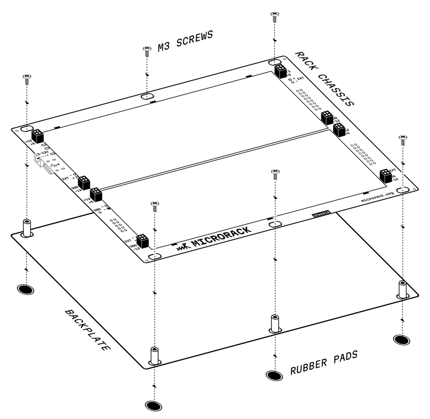
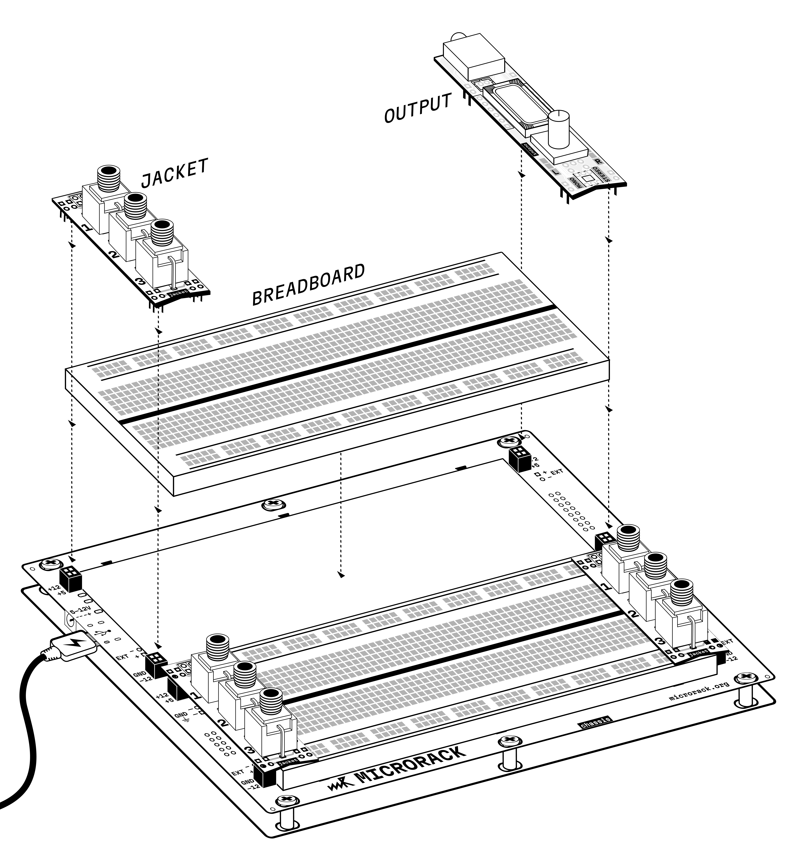

# rack chassis

## Interface

1. GND terminals (×2, one for each breadboard)
2. AUX power input/output: ×4 GND pin and V+ (for chaining chassis and power modules)
3. USB Type-C power input (PD up to 12V or fast charge)
4. DC jack power input (5.1 mm × 2.1 mm, 5–12V)
5. +12V output terminal (for each breadboard) (up to 350 mA)
6. +5V output pin (for each breadboard) (up to 1 A)
7. GND rail pin (for each breadboard)
8. -12V output pin (for each breadboard) (up to 350 mA)
9. Eurorack mounting holes
10. Eurorack 16-pin connectors (×2) for providing power to other modules
11. Eurorack 10-pin connector for powering chassis from Eurorack bus board

## Overview

The chassis is a baseboard that provides power distribution for two independent breadboards. It functions similar to the power module but is designed as a permanent mounting solution for your modular system.

### Assembly

The chassis can be used as a standard Eurorack module or as a standalone portable unit. For standalone use secure the backplate with M3 screws and attach rubber pads (do not overtighten the screws).

### Usage

1. Position the breadboard on the chassis and align it with markings **(do not use adhesive)**.
2. Place I/O modules on the edges to connect the breadboard and the chassis.
3. Power the chassis via the USB‑C, DC jack, or Eurorack connectors.

## Power sources

The chassis can be powered from two sources:

**USB Type-C** — supports Power Delivery (PD) up to 12V or fast charge protocols.

**DC Jack** — accepts 5.1 mm × 2.1 mm DC plug with voltage range from 5V to 12V. The chassis automatically handles voltage conversion.

**Eurorack 10-pin connector** — on the bottom side, the chassis can be powered from a Eurorack bus board using the standard 10-pin connector.

## Output voltages

The chassis converts the input voltage and provides three regulated power rails to each breadboard independently:

- **+12V** — up to 350 mA per breadboard
- **+5V** — up to 1 A per breadboard
- **-12V** — up to 350 mA per breadboard

Each rail has its own fuse protection.

## Protection

- **Input fuse** — maximum input current limited to 3 A
- **+5V output fuses** — protect up to 1 A per breadboard
- **±12V output fuses** — protect up to 350 mA each per breadboard

## Breadboard mounting and power distribution

The chassis features terminals for mounting breadboards. The power distribution concept works as follows:

1. Insert a breadboard between the terminals on the chassis
2. Insert any module with one pair of pins into the chassis terminals (connecting to power rails)
3. Insert the other pair of pins into the breadboard
4. The breadboard receives power through the module, which acts as a power bridge

This design allows modules to serve dual purposes: they function as their intended module while also providing power connectivity to the breadboard.

## Eurorack integration

The chassis can be mounted in a standard Eurorack case using the mounting holes. On the bottom side:

- **10-pin connector** — allows the chassis to be powered from a Eurorack bus board
- **16-pin connectors (×2)** — provide power output to other Eurorack modules, allowing you to power additional modules from the chassis

## Module chaining

The chassis features AUX power pins (V+ and GND) that allow you to chain multiple chassis or power modules together. Connect V+ and GND from one chassis to the corresponding pins on another chassis or power module to distribute power across multiple systems.

## Power consumption

Each module in the system consumes approximately **1 W** of power. When calculating how many modules you can power:

- **USB 5V 2A** = 10 W → maximum **10 modules**
- **USB 12V 1A** = 12 W → maximum **12 modules**
- **DC 12V 1A** = 12 W → maximum **12 modules**

Always account for the chassis itself and leave some headroom for safety. Since the chassis powers two independent breadboards, you can distribute modules across both breadboards, but the total power consumption still applies to the entire system.

## ⚠️ Important warning

**Never hot-plug power-bridging modules!** If a module that provides power to a breadboard (by connecting the chassis terminals to the breadboard) is already powered, do not insert or remove it from a breadboard that already contains other modules. This can cause damage to both the power-bridging module and the modules already installed in the breadboard. Always power down the system before making connections related to modules that bridge power to breadboards.

## Troubleshooting

The chassis has LED indicators for each power rail (+12V, +5V, -12V) for each breadboard. If any LED goes out:

1. A module may be damaged or drawing too much current
2. The power supply may be insufficient for the number of modules
3. Try removing modules one by one until all three LEDs light up again
4. Check for short circuits or incorrect connections
5. Verify that the power-bridging module is properly connected between chassis terminals and breadboard

## Links

- [Schematic B](mod-chassis-b-1.1.pdf)
- [Schematic F](mod-chassis-f-1.2.pdf)
- [Product page](https://microrack.org/market/products/add-rc)

