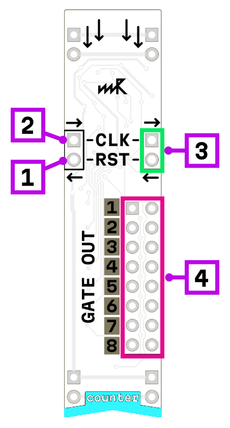

# counter

1. reset input
2. clock input
3. counter/sequencer chain output
4. step output ×8 (2 outputs for each step)

## How it works

Counts from 1 to 8 and then restarts from the beginning. It advances on each trigger or gate received at the clock input. The reset input resets the counter back to step 1.

## Chaining

The chain output pair can be connected to the reset/clock inputs of another counter or sequencer. This allows two counters to work as a single extended counter with more steps — when the first counter completes its cycle, the second one advances.

## Custom step count

To create a counter with fewer than 8 steps, connect the (N+1) step output to the reset input. For example, connecting step 5 output to reset will create a 4-step counter.

*todo add patch image*

## Combining outputs

Step outputs are active-low diodes with pull-down resistors, which means they can be combined (wired together) to trigger on multiple steps.

*todo add link to chaining*

## Power consumption

300 mW

## Links

- 🔌 [Schematic](mod-clk-1.1.pdf)
- 🛒 [Product page](https://microrack.org/market/products/mod-clk)
- 💬 [Forum discussion](https://forum.microrack.org/t/clock-counter/209/1)
