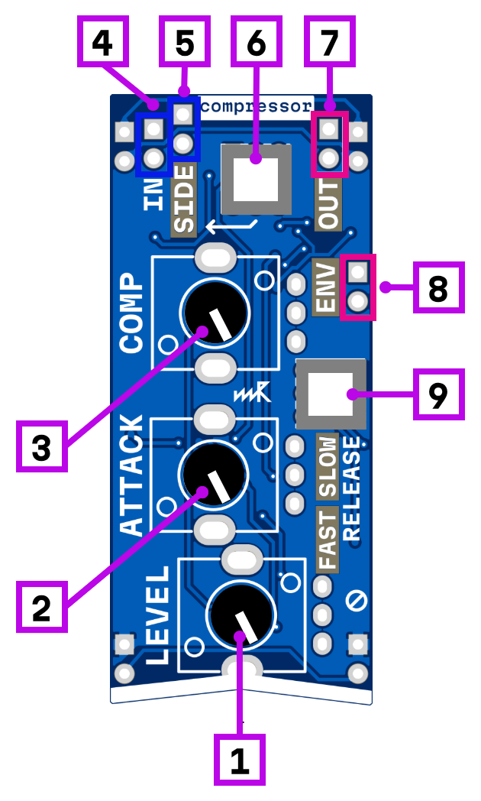

# compressor

1. output level
2. attack/speed control
3. compression level
4. signal input
5. sidechain input (works only in sidechain mode)
6. sidechain mode switch
7. signal output
8. envelope follower output (unbuffered)
9. slow/fast release mode switch

## How it works

The compressor reduces the dynamic range of the input signal. The **compression level [3]** knob controls both threshold and ratio simultaneously — turning it up increases the amount of compression applied.

The **attack [2]** knob adjusts how quickly the compressor responds to transients. The **release mode [9]** button toggles between fast and slow release times. The **output level [1]** knob allows you to compensate for gain reduction.

### Sidechain mode

When the **sidechain button [6]** is pressed, the compressor enters sidechain mode. In this mode, the compression envelope is derived from a separate signal fed into the **sidechain input [5]** instead of the **main input [4]**. This allows the compressor to be triggered by an external source (e.g., ducking a synth pad with a kick drum).

*todo add image for two modes with main inpuit and sidechain input*

### Envelope output

The **envelope follower output [8]** provides the detected envelope signal, which can be used to control other modules.

## Power consumption

300 mW

## Schematic

[Schematic_MOD-COMP-1.1_2025-05-21.pdf](Schematic_MOD-COMP-1.1_2025-05-21.pdf)
