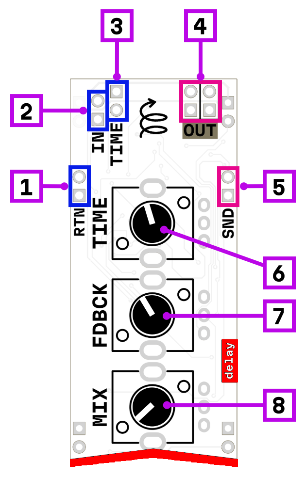

# delay

1. feedback loop return
2. signal input
3. time modulation CV
4. signal output
5. feedback loop send
6. delay time (from 30 ms to 1.5 s)
7. feedback amount
8. dry/wet mix

## How it works

This is a lo-fi delay effect. The **delay time** knob sets the delay length from 30 ms to 1.5 seconds. The **feedback** knob controls how much of the delayed signal is fed back into the delay line, creating repeating echoes. The **dry/wet** knob blends between the original and delayed signals.

### Time modulation

The delay time can be modulated via the CV input, allowing for vibrato, or more experimental pitch-shifting textures.

### Feedback loop insert

The send/return pair acts as an insert point for the feedback loop. When nothing is connected, the feedback signal passes through directly. By patching the send output to external effects and returning the processed signal to the return input, you can add filters, distortion, or other processors into the feedback path.

*todo add internal signal path*

## Power consumption

852 mW

## Links

- 🔌 [Schematic](mod-delay-1.1.pdf)
- 🛒 [Product page](https://microrack.org/market/products/mod-delay)
- 💬 [Forum discussion](https://forum.microrack.org/t/lo-fi-delay-module/88/1)
