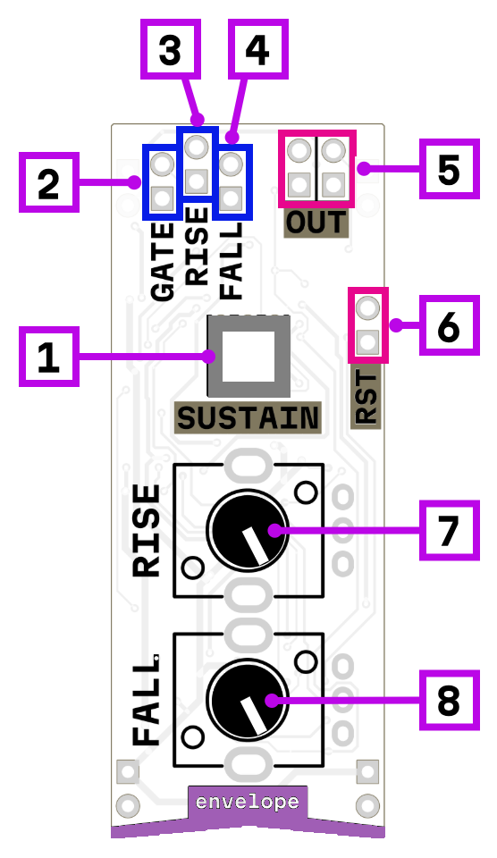

# envelope

1. sustain mode switch
2. trigger/gate/signal input
3. rise time CV modulation
4. fall time CV modulation
5. envelope output
6. end of cycle (reset) gate output
7. rise time (from ? ms to ? s)
8. fall time (from ? ms to ? s)

## How it works

This is a two-stage envelope generator with **rise** and **fall** stages. Both time parameters can be adjusted with knobs and modulated via CV inputs.

### Sustain mode

When the sustain switch is engaged, the envelope follows the input signal level. On a rising gate or signal, it performs the attack stage and then holds the output at the level of the input. When the gate drops, it performs the release stage. In this mode, the module can also function as a **slew limiter** or an **envelope follower** (set a short rise time and a long fall time for envelope following).

*todo gate + output images for AR mode, slew limiter and envelope follower*

### Non-sustain mode

When the sustain switch is off, the envelope triggers on the rising edge of the gate. It performs a full attack-decay cycle automatically — rising to 5V and then falling back to 0V, regardless of how long the gate is held.

*todo images for AD mode*

### End of cycle output

The EOC output goes high when the envelope output reaches zero. This can be used to trigger other modules or to create a **cycling LFO mode** by patching EOC back to the gate input (with sustain mode off).

*todo cycle patch*

## Power consumption

456 mW

## Links

- [Schematic](mod-env-1.3.pdf)
- [Product page](https://microrack.org/market/products/mod-env)
- [Forum discussion](https://forum.microrack.org/t/envelope-generator/210/1)
