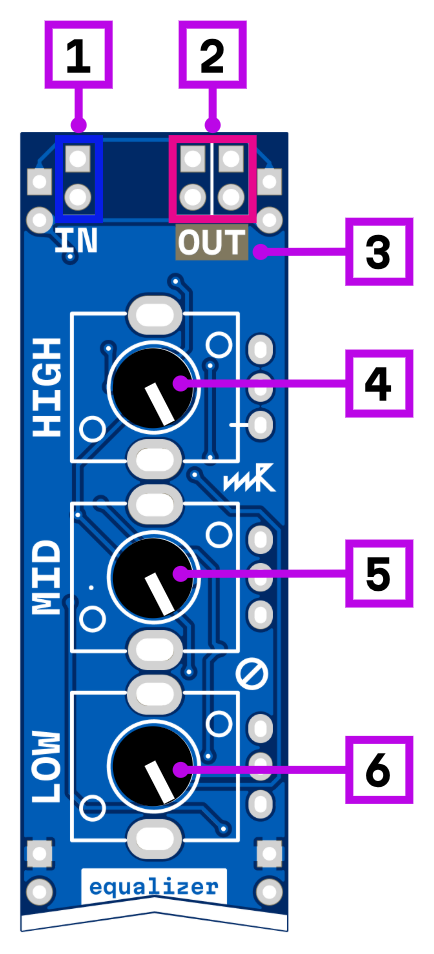

# equalizer

1. signal input
2. signal output
3. signal output level
4. high level (±10 dB @ 15kHz)
5. mid level (±10 dB @ 2.5kHz)
6. low level (±15 dB @ 80 Hz)

# Description

Classic three-band equalizer with low, mid, and high frequency controls for shaping the tonal balance of your signal. Each band can be boosted or cut to fine-tune the mix.

## Power consumption

216 mW

## Links

- 🔌 [Schematic](mod-eq-1.1.pdf)
- 🛒 [Product page](https://microrack.org/market/products/mod-eq)
- 💬 [Forum discussion](https://forum.microrack.org/t/zvukofor-collaborative-modules/201/1)
