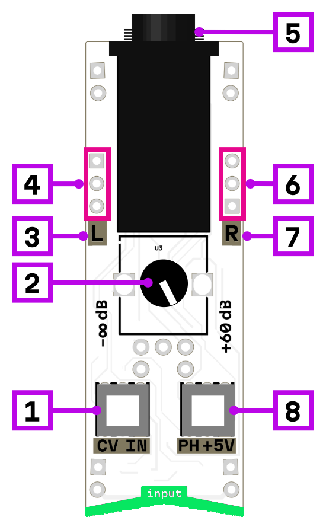

# input 6.3

1. DC block/CV mode switch
2. gain control (from -∞ to +60 dB)
3. left channel signal level
4. left channel signal output
5. 6.3 mm input jack
6. right channel signal output
7. right channel signal level
8. +5 V pull-up (phantom power)

## Description

Stereo input preamplifier with wide gain range from -∞ to +60 dB. Features a +5V pull-up switch for powering electret microphones and expression pedals, and a CV/DC block mode switch for handling both audio and control voltage signals.

Each channel has 3 output pins and a signal level indicator.

- **CV mode on**: no DC blocking, passes DC offset (for CV sources)
- **CV mode off**: DC blocking enabled (for audio signals)

## Signal type reference

| Signal type | +5V | CV mode | Gain |
|-------------|-----|---------|------|
| Line input | off | off | low |
| Dynamic/piezo mic | off | off | high |
| Electret mic | on | off | high |
| CV source | off | on | as needed |
| Sustain/expression pedal | on | on | low |

**Note:** Condenser microphones requiring 48V phantom power are not supported.

## Power consumption

348 mW

## Links

- [Schematic](mod-in-63-1.1.pdf)
- [Product page](https://microrack.org/market/products/mod-in-63)
- [Forum discussion](https://forum.microrack.org/t/input-6-3-jack/204/1)
