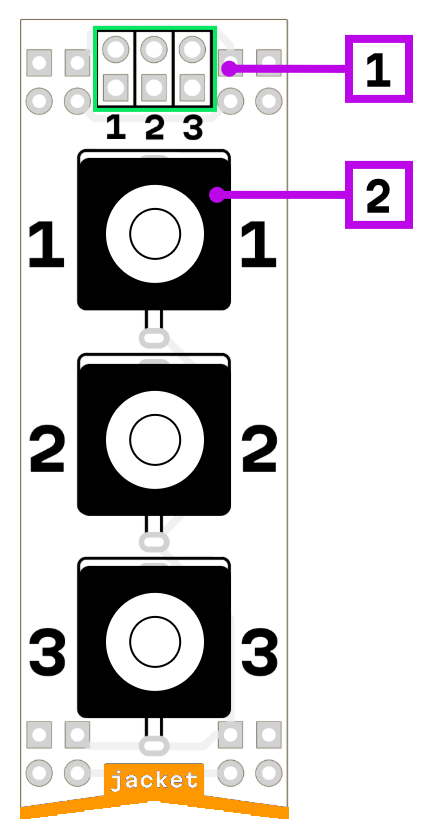

# jacket 3.5

1. microrack I/O ×3
2. mono 3.5 jack modular I/O

## Description

Passive adapter between mono 3.5mm jacks and microrack pins. Each jack is connected to two pins.

Use it to send signals from microrack to a modular system, or to receive signals from a modular system into microrack.

## Power consumption

24 mW

## Schematic

[Schematic](mod-jacket-1.0.pdf)
