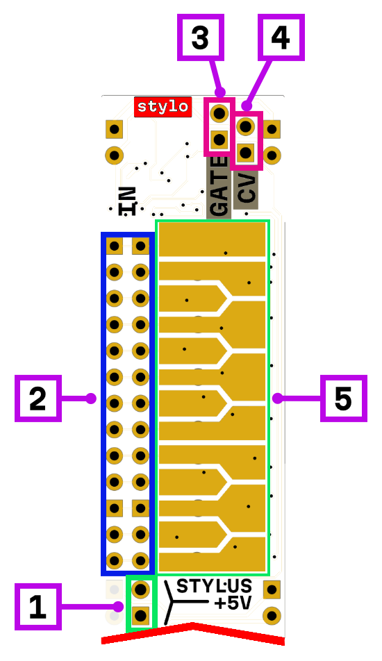

# stylo

1. +5 V for stylus
2. key gate inputs (2 per each key)
3. gate output
4. 1 V/oct output
5. key stylus pads
 
## Description

Stylus keyboard that outputs CV/Gate signals.

Connect an alligator clip wire or male-female jumper to the +5V pins. Now you can play: touching the keyboard pads outputs a Gate signal (5V) and a 1 V/oct CV signal (0V for the first C note, 1V for the last C note). The CV signal remains constant between key presses.

Each pad is also connected to pins, allowing you to connect external gate/trigger sources to activate notes as if you were playing them by hand.

## Power consumption

300 mW
