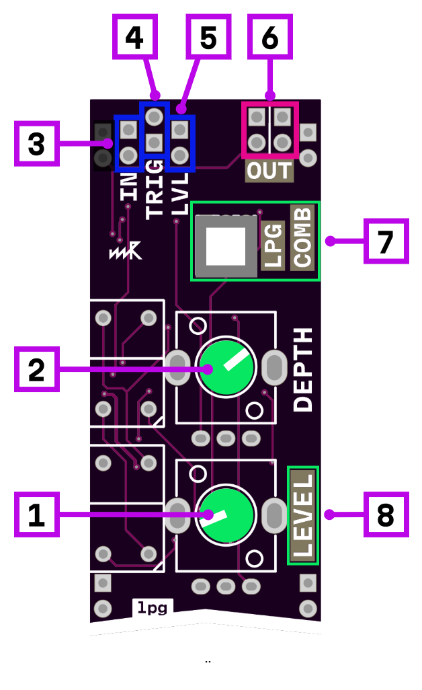

# lowpass gate

1. level control
2. CV modulation depth
3. signal input
4. trigger input (converts any gate to short pulse. You can use Depth knob to control polarity)
5. CV level input
6. signal output
7. LPG/Combo mode switch (LPG has more resonance, Combo is closer to VCA with more high frequencies)
8. signal pass level indicator

## Description

Vactrol-based lowpass gate module. A lowpass gate combines a VCA and a lowpass filter in one circuit — as the gate opens, both volume and brightness increase together. Vactrols provide a natural decay characteristic: even with instant trigger, the sound fades out smoothly due to the vactrol's inherent release time.

### Control methods

The gate can be controlled in three ways:

- **Level knob**: manually open the gate
- **CV level input**: control via CV signal; the Depth knob acts as an attenuverter
- **Trigger input**: accepts gates or triggers; gates are converted to short pulses for sharp attack with natural vactrol decay. The Depth knob also affects trigger polarity: turn right for pulses on gate rise, turn left for pulses on gate fall.

### Modes

- **LPG mode**: more resonance, classic lowpass gate sound
- **Combo mode**: closer to VCA behavior with more high frequencies passing through

## Power consumption

384 mW
