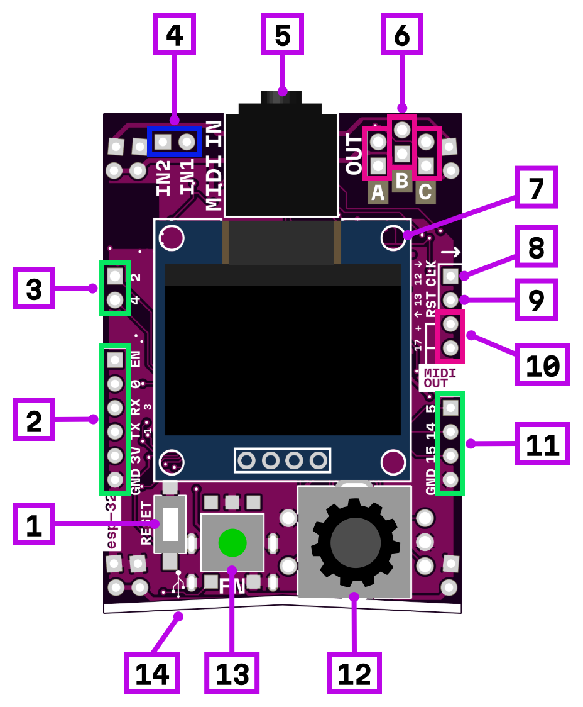

# midi→cv

1. reset button
2. digital IO (Do not connect microrack signals!)
3. digital IO (Do not connect microrack signals!)
4. modular level (from -5 to +5 V) inputs (pins 36, 37)
5. midi TRS input (type-A)
6. microrack level (from -5 to +5 V) outputs (pins 26, 25, 33)
7. 128×64 OLED monochrome display
8. gate output (0 to +3.3 V, pin 12)
9. gate output (0 to +3.3 V, pin 13)
10. MIDI output (3.3 V and pin 17 out, 200 Ohm resistors included)
11. digital IO (Do not connect microrack signals!)
12. encoder + push button (enc. pins 34, 35, button pin 39)
13. push button (pin 38)
14. USB type-C for firmware update and serial connection (on bottom side)

## Power consumption

660 mW
