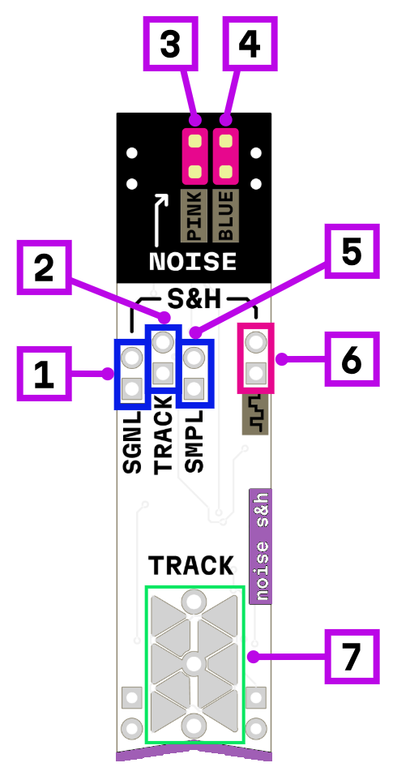

# noise + s&h

1. T&H/S&H signal input
2. tracking gate input
3. pink noise output
4. blue noise output
5. sampling trigger input
6. T&H/S&H signal output
7. manual tracking touch pad

## Power consumption

420 mW

## Schematic

[Schematic_MOD-NOISE-1.3_2025-05-21.pdf](Schematic_MOD-NOISE-1.3_2025-05-21.pdf)
