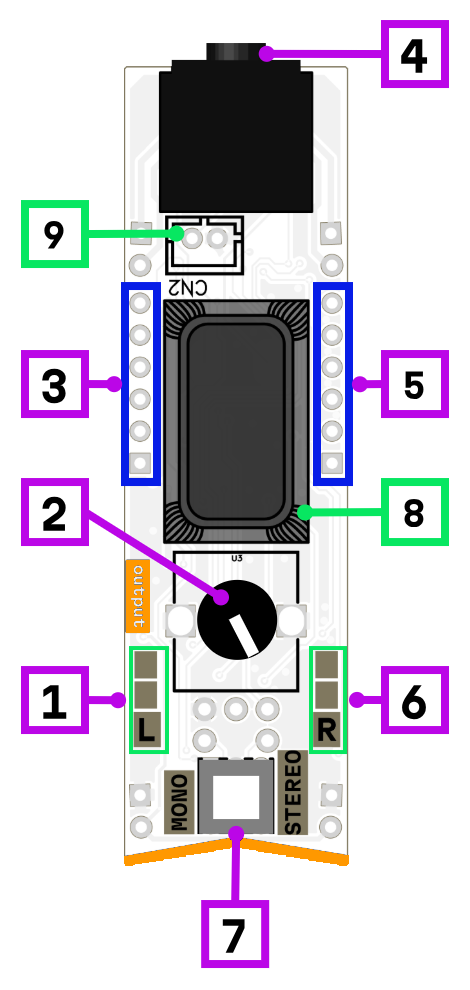

# output 3.5

This is an output module for connecting headphones, external amplifiers, mixers, or powered speakers. Available in two versions: with a 3.5mm jack (this one) and with a 6.3mm jack.

## Features

The module includes a **volume control** knob and **level indicators** for both left and right channels.

### Mono / Stereo modes

The module can operate in two modes, selected by a switch:

- **Mono mode** — all 12 inputs are summed together and sent to both left and right output channels.
- **Stereo mode** — 6 inputs are summed for the left channel and 6 inputs are summed for the right channel, providing true stereo output.

### Built-in speaker (3.5mm version only)

The 3.5mm version features a built-in speaker that automatically activates when nothing is plugged into the output jack. The speaker is connected to the right channel, so it works in:

- **Mono mode** — signal is heard through the speaker
- **Stereo mode** — only right channel inputs are heard (almost twice as loud)

For maximum speaker volume, use stereo mode and route your signal to the right channel inputs.

## Interface

1. left channel signal indicator
2. output volume
3. left/mono channel input
4. output jack
5. right/mono channel input
6. right channel signal indicator
7. mono/stereo mode switch
8. speaker
9. speaker connector

## Power consumption

1740 mW

## Schematic

[Schematic](mod-out-1.2.pdf)
