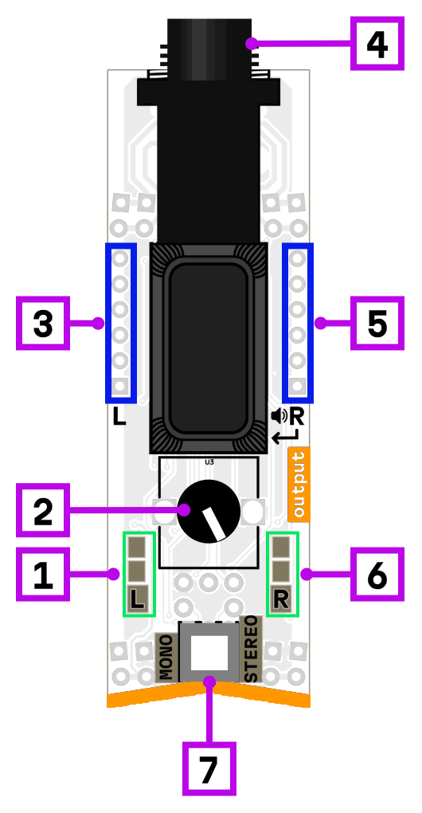

# output 6.3

1. left channel signal indicator
2. output volume
3. left/mono channel input
4. output jack
5. right/mono channel input
6. right channel signal indicator
7. mono/stereo mode switch

This is an output module for connecting headphones, external amplifiers, mixers, or powered speakers. Available in two versions: with a 3.5mm jack and with a 6.3mm jack (this one).

## Features

The module includes a **volume control** knob and **level indicators** for both left and right channels.

### Mono / Stereo modes

The module can operate in two modes, selected by a switch:

- **Mono mode** — all 12 inputs are summed together and sent to both left and right output channels.
- **Stereo mode** — 6 inputs are summed for the left channel and 6 inputs are summed for the right channel, providing true stereo output.

## Power consumption

780 mW

## Links

- [Schematic](mod-out-1.2.pdf)
- [Product page](https://microrack.org/market/products/mod-out-63)
