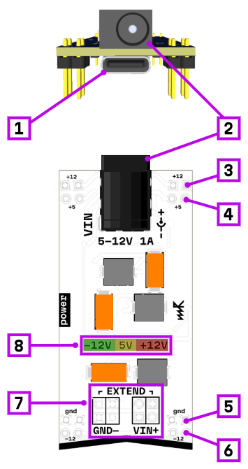
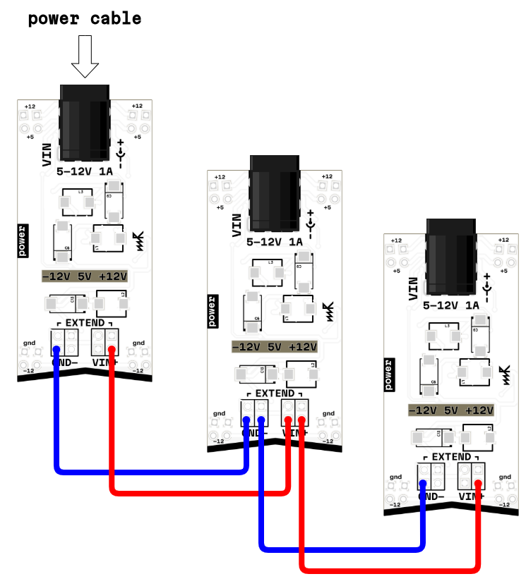
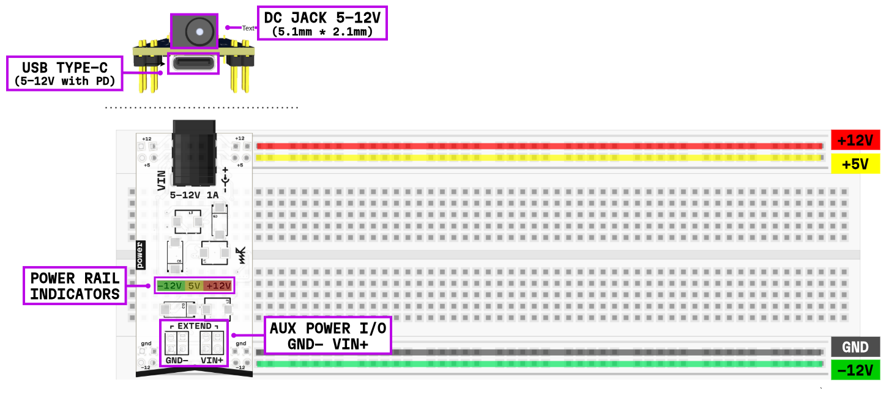

# power

## Interface

1. USB Type-C power input (PD up to 12V or fast charge)
2. DC jack power input (5.1 mm × 2.1 mm, 5–12V)
3. +12V output pin for breadboard (up to 350 mA)
4. +5V output pin for breadboard (up to 1 A)
5. GND rail pin for breadboard
6. -12V output pin for breadboard (up to 350 mA)
7. AUX power input/output: GND ×4 pin and V+ ×4 pin (for chaining modules)
8. 3× power rail indicators (LEDs for +12V, +5V, -12V)

## Power sources

The power module can be powered from two sources:

**USB Type-C** — supports Power Delivery (PD) up to 12V or fast charge protocols.

**DC Jack** — accepts 5.1 mm × 2.1 mm DC plug with voltage range from 5V to 12V. The module automatically handles voltage conversion.

## Output voltages

The module converts the input voltage and provides three regulated power rails to the breadboard:

- **+12V** — up to 350 mA
- **+5V** — up to 1 A
- **-12V** — up to 350 mA

Each rail has its own fuse protection.

## Protection

- **Input fuse** — maximum input current limited to 3 A
- **+5V output fuse** — protects up to 1 A
- **±12V output fuses** — protect up to 350 mA each

## Module chaining

The module features AUX power pins (V+ and GND) that allow you to chain multiple power modules together. Connect V+ and GND from one module to the corresponding pins on another module to distribute power across multiple breadboards.

## Breadboard connections

The module provides power to the breadboard through dedicated pins. The voltage distribution is shown below:

## Internal schematic

## Power consumption

Each module in the system consumes approximately **1 W** of power. When calculating how many modules you can power:

- **USB 5V 2A** = 10 W → maximum **10 modules**
- **USB 12V 1A** = 12 W → maximum **12 modules**
- **DC 12V 1A** = 12 W → maximum **12 modules**

Always account for the power module itself and leave some headroom for safety.

## ⚠️ Important warning

**Never hot-plug the power module!** If the power module is already powered, do not insert or remove it from a breadboard that already contains other modules. This can cause damage to both the power module and the modules already installed. Always power down the system before making connections related to the power module.

## Troubleshooting

The module has LED indicators for each power rail (+12V, +5V, -12V). If any LED goes out:

1. A module may be damaged or drawing too much current
2. The power supply may be insufficient for the number of modules
3. Try removing modules one by one until all three LEDs light up again
4. Check for short circuits or incorrect connections

## Links

- 🔌 [Schematic](mod-pwr-1.3.pdf)
- 🛒 [Product page](https://microrack.org/market/products/mod-pwr)
- 💬 [Forum discussion](https://forum.microrack.org/t/power-module/467/1)
