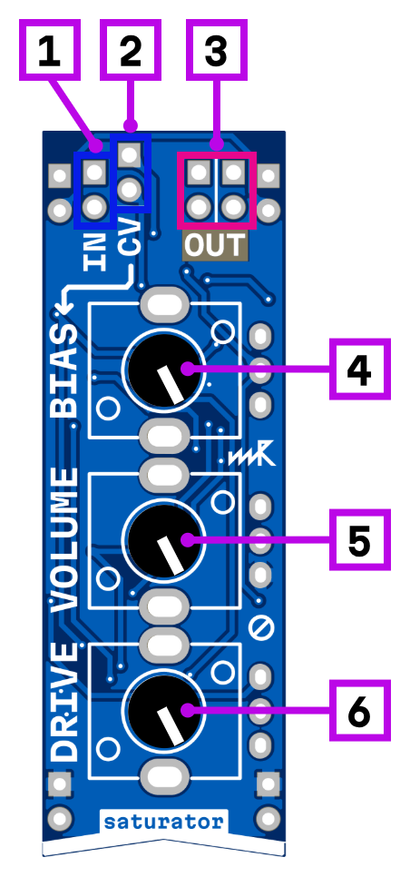

# saturator

## Interface

1. signal input
2. bias CV control
3. signal output
4. saturation bias
5. output volume
6. saturation drive control

Saturator adds harmonic richness and grit to your signal by soft-clipping the waveform. At low drive settings it warms up the sound with subtle harmonic content, similar to analog tape or tube gear. Pushing the drive higher introduces more aggressive distortion, from crunchy overdrive to full-on fuzz.

**Drive** — controls the intensity of signal distortion.

**Bias** — alters the signal waveform distortion. In the far-left position, amplitude clipping is applied to the lower half-wave; in the far-right position, it affects the upper half-wave. In the center, distortion is symmetrical for both waveforms.

The bias parameter has a **CV input**, allowing dynamic modulation of the distortion character with envelopes, LFOs, or other control signals.

**Output volume** — adjusts the output level after saturation, letting you tame the boosted signal or match levels with the rest of your patch.

## Power consumption

348 mW

## Links

- 🔌 [Schematic](mod-sat-1.0.pdf)
- 🛒 [Product page](https://microrack.org/market/products/mod-sat)
- 💬 [Forum discussion](https://forum.microrack.org/t/zvukofor-collaborative-modules/201/1)
