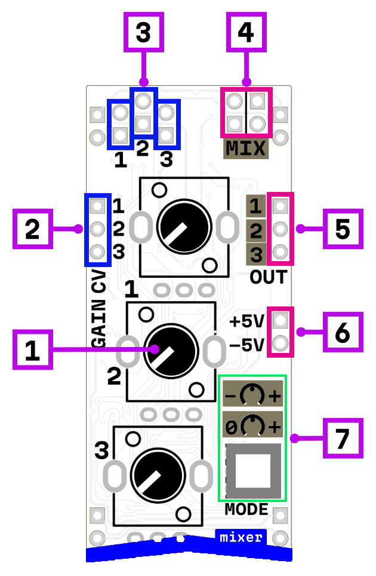

# vca mixer

## Interface

1. 3× gain knobs
2. gain CV modulation inputs
3. signal inputs
4. mix output (sum of all channels)
5. per-channel outputs
6. static +5 V and -5 V outputs
7. attenuator/attenuverter switch

A three-channel mixer based on a ring modulator circuit.

Each channel has a **signal input**, a **gain knob**, and a **CV input** for voltage-controlled gain. The CV input is summed with the knob position, allowing external modulation around the manual setting. Each channel also has its own **individual output**, plus there's a **mix output** that sums all three channels together.

## Attenuator vs Attenuverter

A switch selects between two modes for all channels:

**Attenuator mode** — the gain knob scales the signal from 0% to 150%. The signal amplitude is reduced but the polarity stays the same. Knob at minimum = silence, knob at maximum = maximum gain.

**Attenuverter mode** — the gain knob goes from −150% through 0% to +150%. At center position the signal is silent. Turning left inverts and scales the signal, turning right scales it normally. This allows you to flip the polarity of control voltages, create inverted copies of modulation signals, or subtract signals in the mix output.

Attenuverters are essential for shaping modulation depth and direction — for example, making an LFO sweep a filter downward instead of upward.

> **Known issues:** the second and third channels are slightly noisy, and in attenuator mode the silence point may not be exactly at the minimum knob position.

## Static voltage outputs

The module provides **+5V** and **−5V** reference outputs, useful for offsetting signals or as fixed CV sources.

## Power consumption

1020 mW

## Links

- [Schematic](mod-mix-1.2.pdf)
- [Product page](https://microrack.org/market/products/mod-mix)
- [Forum discussion](https://forum.microrack.org/t/mixer-3xvca/208/1)
