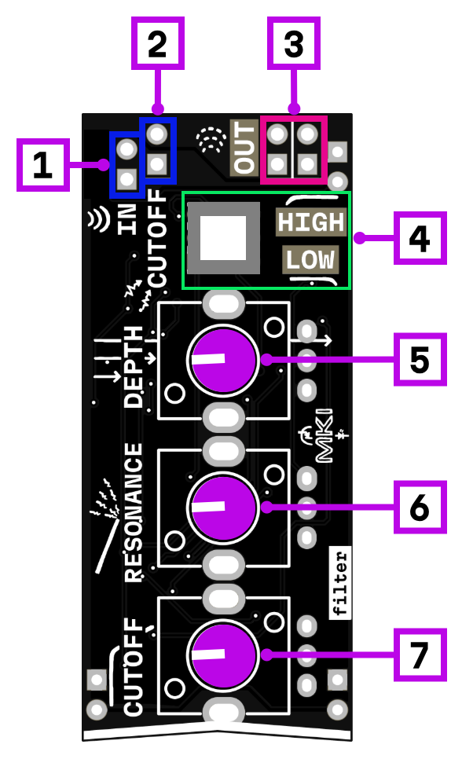

# filter

## Interface

1. signal input
2. cutoff modulation input
3. signal output
4. highpass/lowpass mode switch
5. CV modulation depth (attenuverter)
6. resonance control
7. cutoff frequency control

A voltage-controlled filter based on a diode ladder topology. Filters shape the harmonic content of a signal by attenuating frequencies above or below a certain point.

## Filter modes

The **HP/LP switch** selects between two modes:

**Lowpass (LP)** — frequencies below the cutoff pass through, higher frequencies are attenuated. This removes brightness and harshness, creating warmer, darker tones. The classic subtractive synthesis sound.

**Highpass (HP)** — frequencies above the cutoff pass through, lower frequencies are attenuated. This thins out the sound, removing bass and body while keeping the higher harmonics.

## Cutoff

The **cutoff frequency** determines where the filter starts working. In lowpass mode, everything above this frequency gets quieter; in highpass mode, everything below gets quieter. The cutoff knob sweeps this frequency across the audible range.

## Resonance

The **resonance** control adds emphasis at the cutoff frequency by feeding some of the filter's output back into its input. At low settings it adds a subtle peak, making the cutoff point more pronounced. Higher resonance creates a sharper, more aggressive peak that can make the filter "sing" or even self-oscillate at extreme settings.

## CV modulation

The **CV input** allows external control of the cutoff frequency — connect an envelope for dynamic filter sweeps, an LFO for wobble effects, or a keyboard CV for tracking pitch.

The **depth knob** is an attenuverter that controls how much the CV affects the cutoff and in which direction. Center position = no modulation. Turn right for positive modulation (CV increases cutoff), turn left for inverted modulation (CV decreases cutoff).

## Power consumption

540 mW

## Links

- [Schematic](mod-vcf-1.1.pdf)
- [Product page](https://microrack.org/market/products/mod-vcf)
- [Forum discussion](https://forum.microrack.org/t/voltage-controlled-filter-vcf/82/1)
