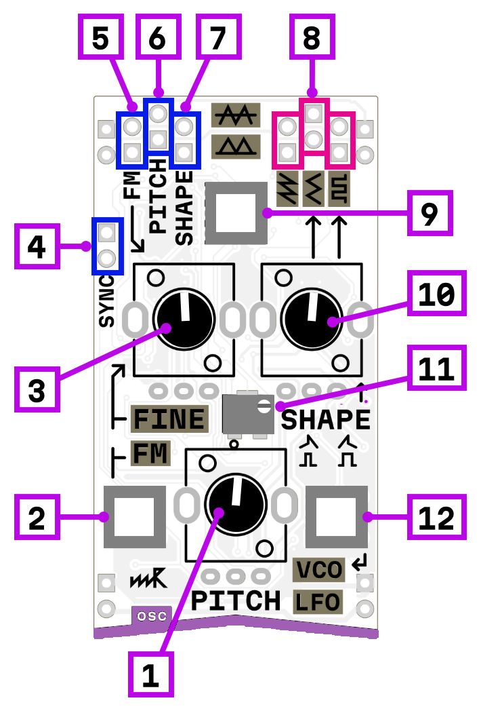

# oscillator

## Interface

1. pitch/speed frequency
2. fine/FM mode switch
3. fine tune in fine mode, FM amount in FM mode
4. hard sync input/LFO reset
5. FM input (works only in FM mode)
6. V/oct pitch input
7. signal shape modulation (affects only on square and triangle output)
8. signal outputs: saw, triangle, square
9. output mode: bipolar (-5 to +5 V), unipolar (0 to +5 V)
10. shape control (affects only on square and triangle output): for square controls pulse width
11. V/oct tune trim
12. VCO/LFO mode switch

An oscillator is the primary sound source in a synthesizer. It generates a periodic waveform at a specific frequency — this is what you hear as pitch. By changing the frequency and shape of the waveform, you create different tones that can then be processed by filters, amplifiers, and effects.

## VCO / LFO modes

The oscillator can operate in two modes:

**VCO mode** — audio-rate oscillator ranging from 3 Hz to 3.5 kHz. Use this for generating audible tones.

**LFO mode** — low-frequency oscillator with a period from 0.02 to 30 seconds. Use this for modulating other parameters like filter cutoff, amplitude, or another oscillator's pitch.

## Pitch control

The **pitch knob** sets the base frequency of the oscillator.

The **V/Oct input** accepts 1 volt-per-octave control voltage for precise pitch tracking from keyboards or sequencers. A **trimmer** on the module allows calibration to achieve accurate 1V/Oct tracking.

## Waveforms

Three simultaneous outputs provide different waveforms:

- **Saw** — all harmonics, bright and buzzy sound
- **Triangle** — odd harmonics only, softer and more mellow
- **Square** — odd harmonics, hollow and woody character

## Shape control

The **shape knob** and **shape CV input** modify the waveform character:

- For **square wave** — controls pulse width, from thin narrow pulses to wide rectangular waves
- For **triangle wave** — offsets the two halves of the waveform relative to each other, skewing the triangle shape
- **Saw wave** is not affected by shape control

## Output modes

A switch selects between:

- **Bipolar** — output swings from −5V to +5V (typical for audio signals)
- **Unipolar** — output ranges from 0V to +5V (useful for modulation, especially envelopes and triggers)

## Fine tune / FM

A switch selects between two modes:

**Fine mode** — the fine/FM knob provides precise pitch adjustment for tuning. The FM input is disabled.

**FM mode** — the fine/FM knob controls the depth of frequency modulation from the **FM input**. FM (frequency modulation) creates complex, often metallic or bell-like timbres by modulating the oscillator's frequency with another signal.

## Hard sync

The **sync input** resets the oscillator's waveform cycle when it receives a trigger. When synced to another oscillator, this creates the classic hard sync sound — as you change the synced oscillator's pitch, the waveform is repeatedly cut short and restarted, producing distinctive harmonically-rich timbres that track the master oscillator's pitch while adding aggressive overtones. In LFO mode, this input resets the LFO cycle.

## Power consumption

732 mW
